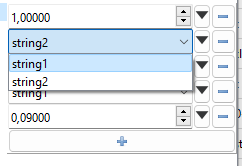
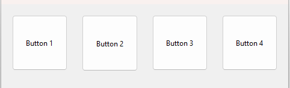
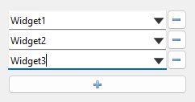
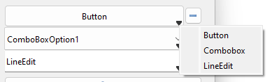

# PySide6 - Utils

`pyside6-utils` implements several useful PySide6 widgets, models and delegates as well as some utility functions.
The package contains registrars for these widgets, which can be [used to register the widgets in QtDesigner](#qt-designer) to quickly build UI's.

This package was mainly developed around the python Dataclass-functionality. It was created in tandem with the following package: [Configurun - A tool to create and manage machine learning training/testing-configurations and run them automatically and/or remotely.](https://github.com/Woutah/configurun).

# Table of contents

- [PySide6 - Utils](#pyside6---utils)
- [Table of contents](#table-of-contents)
- [Features](#features)
	- [Installation](#installation)
	- [Qt-Designer](#qt-designer)
- [Widgets](#widgets)
	- [`DataclassTreeview`](#dataclasstreeview)
	- [`PandasTableView` (and `PandasTableModel`)](#pandastableview-and-pandastablemodel)
	- [`ExtendedMdiArea` / `FramelessMdiWindow`](#extendedmdiarea--framelessmdiwindow)
	- [`CollapsibleGroupBox`](#collapsiblegroupbox)
	- [`Console Widget`](#console-widget)
	- [`FileExplorerView`](#fileexplorerview)
	- [`OverlayWidget`](#overlaywidget)
	- [`RangeSelector`](#rangeselector)
	- [`SquareFrame`](#squareframe)
	- [`WidgetList`](#widgetlist)
	- [`WidgetSwitcher`](#widgetswitcher)
- [Utility](#utility)
- [Models](#models)
- [Acknowledgements](#acknowledgements)

# Features

A quick list of the main widgets:

- [`DataclassTreeview` (and `DataClassModel` & `DataClassEditorDelegate`)](#dataclasstreeview)
  - A view/model/delegate combination which mirrors a python dataclass (`@dataclass`) object and provides editors for each of the types defined. Edits are propagated to the dataclass object. We can use [`dataclasses.field()`](https://docs.python.org/3/library/dataclasses.html#dataclasses.Field) to customize how attributes are displayed and to change the editor-type and constraints.
- [`PandasTableView` (and `PandasTableModel`)](#pandastableview-and-pandastablemodel)
  - Provide an easy way to show and edit pandas dataframes
- [`CollapsibleGroupBox`](#collapsiblegroupbox)
  - A groupbox that acts as a layout, when the user check/unchecks the groupbox, the contents collapse
- [`ConsoleWidget`](#console-widget)
  - A console-like widget to which multiple files can be mirorred, user can select the items to view the consoleitem-contens
- [`ExtendedMdiArea` / `FramelessMdiWindow`](#extendedmdiarea--framelessmdiwindow)
  - Based on PySide6.QtWidgets.QMdiArea, provides a way to load frameless windows with a custom UI, while also retaining resize/move/etc. A custom UI example is provided in `./ui/FrameslessMdiWindow.ui`
- [`FileExplorerView`](#fileexplorerview)
  - Built around the use of a QFileSystemModel - enables right-click operations and undo/redo actions, as well as the possibility to set a "highlighted" file
- [`OverlayWidget`](#overlaywidget)
  - Provides a container-widget to which another widget can be provided, when turning the overlay-mode of this widget on, this widget will be overlayed over the contained widget(s)
- [`SquareFrame`](#squareframe)
  - A small widget wrapper that enforces squareness. Useful when designing UI's in QtDesigner.
- [`RangeSelector`](#rangeselector)
  - Widget to select a range of float/int/datetime, provides extra styling if ticks are provided.
- [`WidgetList`](#widgetlist)
  - Widget to which we can pass a widget-factory or widget-type. The user can then add/remove widgets of this type to the list.
- [`WidgetSwitcher`](#widgetswitcher)
  - Wrapper around [`QtWidgets.QStackedWidget`](https://doc.qt.io/qt-6/qstackedwidget.html), provides a way to switch between multiple widgets.

## Installation

The easiest way to install this package is using pip install:

``` bash
pip install pyside6-utils
```

The package can also be manually installed by downloading this repository, extracting it to the desired install location and running:

``` bash
pip install <install_path>
```

## Qt-Designer

This package provides registrars for the implemented widgets, which means that the widgets can be made available directly in qt-designer (note that `pyside6-designer` should be used).
To enable this, the environment variable `PYSIDE_DESIGNER_PLUGINS` should be set to the `../pyside6_utils/registrars`-folder.

Alternatively, we can automatically set environment variables by using the provided pyside6 launch script. We can use this script by running `pyside6_utils/examples/run_qt_designer.py` or by importing and running the `run_qt_designer()`-function using:

``` python
from pyside6_utilities.examples import run_qt_designer
run_qt_designer()
```

If all is well, this should result in the widgets showing up in the left-hand side of Qt-designer, e.g. for the views it should look like this:
<p align="center">
	
</p>

# Widgets

**NOTE: every widget-module contains a `run_example_app()` function, which starts a qt app and an example-instance of the widget in question, the following example-widget-images are pictures of these examples. Example:**

```python
from pyside6_utils.widgets.data_class_tree_view import run_example_app
DataclassTreeview.run_example_app()
```

## `DataclassTreeview`

`DataclassTreeview`, `DataClassModel` and `DataClassEditorDelegate` are a view/model/delegate combination (resp.) which mirror a python dataclass (`@dataclass`) object and provides editors for each of the types defined.

The model is mainly built around the `field()` functionality of dataclasses, which allows the model to make use of the default values, type hints and other information provided by the dataclass.
For each field, we can provide additional information in the `metadata` attribute of `field()`, this information is used by the model to determine the editor/limits to use for the field.
The following metadata is supported:

| Metadata Key | Type | Description |
| --- | --- | --- |
| `"display_name"` | `str` | Name to display for this attribute in the view - defaults to the variable name itself |
| `"display_path"` | `str` | Path to display this attribute - we can group/structure items when using a treeview - defaults to no parents|
| `"help"` | `str` | Help-message which will be shown when the user hovers over this item - empty by default|
| `"constraints"` | `List[sklearn_param_validation constraints]` | Additional constraints on which the editor will be determined to apply to the field [*](#constraintnote) , if none provided, use typehint of the field|
| `"required"` | `bool` | Whether this field is required to be filled in - if true - a red background will appear if the value is not set|
| `"editable"` | `bool` | Whether this field is editable - if false - the editor will be disabled|

<a name="constraintnote">*</a>Constraints are (almost fully) sourced from the `sklearn.utils._validation` module and provides a way to constrain the dataclass fields such that the user can only enter valid values. They are also packed into this package under `utility.constraints`. The following constraints are supported:
| Constraint | Description | Editor Type
| --- | --- | --- |
| `type` | The type of the value should match the type of the constraint | based on type |
| `Options` / `Container` | The value should be one of the options provided in the constraint | `QComboBox` |
| `StrOptions` | The value should be one of the str-options provided in the constraint | `QComboBox` |
| `Interval` | The value should be within the interval provided in the constraint | `QSpinBox` or `QDoubleSpinBox` (limited) |
| `None` | `None` is a valid value for this field `typing.Optional` | Adds reset-button to editor |
| `Range` | The value should be within the range provided in the constraint | `QSpinBox` (limited) |
| `ConstrainedList` | [*(Custom - not part of Sklearn)](#constrainedlist) Indicates a list of of values of a constrained type | Based on type of list |

<a name="constrainedlist">*=</a>For example, `ConstrainedList([Interval(float, 0.0, 1.0), StrOptions(["string1", "string2"])])` indicates a list of values that should either be a float between 0.0 and 1.0, or the string "string1" or "string2". The editor for this field would be constructed as a [`WidgetList`](#widgetlist) with a [`WidgetSwitcher`](#widgetswitcher) as the factory-widget. The `WidgetSwitcher` would then have two widgets, one with a `QSpinBox` and one with a `QComboBox` as the editor. **NOTE:** the same editor would be the result of a `Typing.List[typing.Union[float, str]]` typehint, minus the bounded-interval constraint on the float:
<p align="center">
	
	<!--  -->
</p>

Default values are saved and can be reset using right-click context menu. Values that have changed from default will appear in bold.

An example of a dataclass-view is shown below:
<p align="center">
	
</p>

The dataclass from which this example was generated can be found under `./examples/example_dataclass.py`.

## `PandasTableView` (and `PandasTableModel`)

Provide an easy way to show and edit pandas dataframes. Pandas-table model adds the possibility to copy/paste data from excel, as well as current selection information (e.g. selected cells, average, total and sum).
<p align="center">
	
</p>

## `ExtendedMdiArea` / `FramelessMdiWindow`

Based on PySide6.QtWidgets.QMdiArea, provides a way to load frameless windows with a custom UI, while also retaining resize/move/etc. The ui used by default is provided in `./ui/FrameslessMdiWindow.ui`.

<p align="center">
	
</p>

We can drag, resize and move the windows as we would expect from a normal window. The windows can also be maximized and minimized using the buttons in the top-right corner. A custom UI can be provided, all functionality will be retained if the ui contains the following widgets:

- `contentLayout` (`QtWidgets.QLayout`): The layout that will be used to add the content-widget
- `titleBar` (`QtWidgets.QWidget`): The widget that will be used as the title bar, we can drag the window by using this, the parent-mdi area context menu will also be made available when right-clicking this widget
	- `titleLabel` (`QtWidgets.QLabel`): The label that will be used to display the title
	- `zoomButton` (`QtWidget.QButtton`): If pressed, set window to fullscreen
	- `minimizeButton` (`QtWidget.QButtton`): If pressed, minimize the window

## `CollapsibleGroupBox`

A QtWidgets.QGroupbox that acts as a layout, when the user check/unchecks the groupbox, the contents collapse
When opened:
<p align="center">
	
</p>
When collapsed:
<p align="center">
	
</p>

## `Console Widget`

We can import `console_from_file_item` from `pyside6_utils.models.console_widget_models` to create console items which mirror a text-output file. We can then add these items to the console-widget using `ConsoleWidget.add_item`.

The user can then scroll between the various console-outputs, which are updated every time the target file changes. This is especially useful for managing multiple output-files.
<p align="center">
	
</p>

## `FileExplorerView`

Built around the use of a QFileSystemModel - enables right-click operations and undo/redo actions, as well as the possibility to set a "highlighted" file

<p align="center">
	
</p>

## `OverlayWidget`

Provides a container-widget to which another widget can be provided, when turning the overlay-mode of this widget on, this widget will be overlayed over the contained widget(s).

<p align="center">
	
</p>

## `RangeSelector`

Widget to select a range of float/int/datetime etc. Can drag in the middle to change both, or drag on the edges to change only min/max.
Provides extra styling when ticks are enabled.
<p align="center">
	
</p>

## `SquareFrame`

Enforces squareness of the widget inside. Useful when designing UI's in QtDesigner.
<p align="center">
	<!--  -->
	
</p>

## `WidgetList`

Widget to which we can pass a widget-factory or widget-type. The user can then add/remove widgets of this type to the list.
A value-getter can be specified to easily get the values of all widgets in the list.
<p align="center">
	
	<!--  -->
</p>

## `WidgetSwitcher`

Wrapper around [`QtWidgets.QStackedWidget`](https://doc.qt.io/qt-6/qstackedwidget.html), provides a way to switch between multiple widgets. A context menu can be accessed via right click or via the small triangle in the right-bottom corner, which allows the user to switch between the widgets.

Especially useful in combination with [`WidgetList`](#widgetlist). Provides the same value-getter functionality as `WidgetList`.
<p align="center">
	
	<!--  -->
</p>

# Utility

The utility submodule provides the following:

- `catch_show_exception_in_popup_decorator`
  - A decorator that catches exceptions and shows them in a popup
- `constraints`
  - Sklearn constraints, used for `DataClassModel` to constrain the editor-type based on the type-hint of the field
- `Serializable`
  - Base-class mainly targeted towards dataclasses - enable serialization to json.
- `SignalBlocker`
  - Enables us to temporarily block PySide6 signals using a `with` statement
- `utility_functions`
  - Several smaller utility functions used in this package

# Models

The models submodule provides an implementation of the following:

- `ConsoleFromFileItem` / `ConsoleModel`
  - Also see `ConsoleFromFileWidget` - A model/item combination that mirrors a text-file, used in `ConsoleWidget`. Use the `addItem()` method of `ConsoleModel` to add a new file to the model.
- `DataclassModel`
  - Also see `DataclassTreeview` - A model that mirrors a python dataclass (`@dataclass`) object and provides editors for each of the types defined. Edits are propagated to the dataclass object.
- `ExtendedSortFilterProxyModel`
  - Implements more advanced sorting (using multiple columns) and a `set_filter_function(...)` that can be used to use (multiple) custom methods to filter the model.
- `FileExplorerModel`
  - Also see `FileExplorerView` - Enabled highlighting items
- `PandasTableModel`
  - Also see `PandasTableView` - Mirrors pandas dataframe to a Qt tablemodel

# Acknowledgements

This package uses icons from (and based off) the [Tango Desktop Project](http://tango.freedesktop.org/Tango_Desktop_Project).
