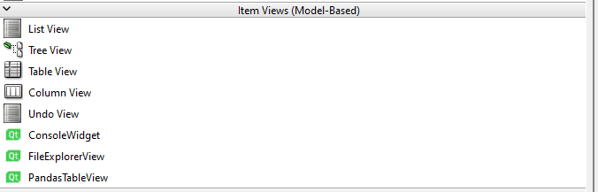
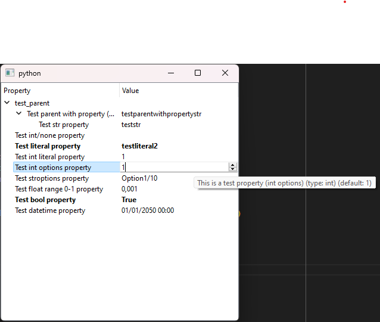

# PySide6 Utilities
PySide6-utilities implements several useful PySide6 widgets, models and delegates as well as some other utility functions
The package contains registrars for all new widgets, which can be used register the widgets in QtDesigner to quickly build UI's.

This package was mainly developed around the DataClass-visualization, in tandem with []. 


A quick list of the main widgets:
- [`DataclassTreeview` (and `DataClassModel` & `DataClassEditorDelegate`)](#DataclassTreeview)
  - A view/model/delegate combination which mirrors a python dataclass (`@dataclass`) object and provides editors for each of the types defined. Edits are propagated to the dataclass object.
- [`PandasTableView` (and `PandasTableModel`)](#PandasTableView)
  - Provide an easy way to show and edit pandas dataframes
- [`CollapsibleGroupBox`](#CollapsibleGroupBox)
  - A groupbox that acts as a layout, when the user check/unchecks the groupbox, the contents collapse
- [`ConsoleWidget`](#ConsoleWidget)
  - A console-like widget to which multiple files can be mirorred, user can select the items to view the consoleitem-contens
- [`ExtendedMdiArea` / `FramelessMdiWindow`](#ExtendedMdiArea)
  - Based on PySide6.QtWidgets.QMdiArea, provides a way to load frameless windows with a custom UI, while also retaining resize/move/etc. A custom UI example is provided in `./ui/FrameslessMdiWindow.ui` 
- [`FileExplorerView`](#FileExplorerView)
  - Built around the use of a QFileSystemModel - enables right-click operations and undo/redo actions, as well as the possibility to set a "highlighted" file
- [`OverlayWidget`](#OverlayWidget)
  - Provides a container-widget to which another widget can be provided, when turning the overlay-mode of this widget on, this widget will be overlayed over the contained widget(s)
- [`Square]
- [`RangeSelector`](#RangeSelector)
  - Widget to select a range of float/int/datetime etc.  *NOTE: work in progress*


## Installation
The easiest way to install this package is using PyPi
```
pip install **TODO**
```

The package can also be manually installed by downloading this repository, extracting it to the desired install location and installing it using:
```
pip install <path>
```
Optionally, we can provide the `-e` argument to pip to be able to edit the package. 

## Qt-Designer
This package provides registrars for the implemented widgets, meaning that the widgets can be made available directly in qt-designer (only `pyside6-designer` supports this functionality).
To enable this, the environment variable `PYSIDE_DESIGNER_PLUGINS` should be set to `<install_path>/registrars`, so that the widgets can be loaded in using the `QPyDesignerCustomWidgetCollection.registerCustomWidget` method.

Alternatively, we can automatically set environment variables by using the pyside6 launch script. We can do this by running `<install_path>/examples/run_qt_designer.py` or by importing and running `run_qt_designer()` using:
```
from pyside6_utilities.examples import run_qt_designer
```

If all is well, this should result in the widgets showing up in the left-hand side of Qt-designer, e.g. for the views it should look like this:
<p align="center">
	
</p>


# Widgets


## `DataclassTreeview`
`DataclassTreeview`, `DataClassModel` and `DataClassEditorDelegate` are a view/model/delegate combination (resp.) which mirror a python dataclass (`@dataclass`) object and provides editors for each of the types defined.

The model is mainly built around the `field()` functionality of dataclasses, which allows the model to make use of the default values, type hints and other information provided by the dataclass.
For each field, we can provide additional information in the `metadata` attribute of `field()`, this information is used by the model to determine the editor/limits to use for the field.
The following metadata is supported:

| Metadata Key | Type | Description |
| --- | --- | --- |
| `"display_name"` | `str` | Name to display for this attribute in the view - defaults to the variable name itself |
| `"display_path"` | `str` | Path to display this attribute - we can group/structure items when using a treeview - defaults to no parents|
| `"help"` | `str` | Help-message which will be shown when the user hovers over this item - empty by default|
| `"constraints"` | `List[sklearn_param_validation constraints]` | Additional constraints on which the editor will be determined to apply to the field [^constraint_note], if none provided, use typehint of the field|
| `"required"` | `bool` | Whether this field is required to be filled in `TODO`|

[^constraint_note]Constraints are (almost fully) sourced from the `sklearn.utils._validation` module and provides a way to constrain the dataclass fields such that the user can only enter valid values. They are also packed into this package under `utility.constraints`. The following constraints are supported:
| Constraint | Description | Editor Type
| --- | --- | --- |
| `type` | The type of the value should match the type of the constraint | based on type |
| `Options` / `Container` | The value should be one of the options provided in the constraint | `QComboBox` |
| `StrOptions` | The value should be one of the str-options provided in the constraint | `QComboBox` |
| `Interval` | The value should be within the interval provided in the constraint | `QSpinBox` or `QDoubleSpinBox` (limited) |
| `None` | `None` is a valid value for this field `typing.Optional` | Adds reset-button to editor |
| `Range` | The value should be within the range provided in the constraint | `QSpinBox` (limited) |
| `TODO` | Maybe more? |

Default values are saved and can be reset using right-click context menu. Values that have changed from default will appear in bold.

An example of a dataclass-view is shown below:
<p align="center">
	
</p>

The dataclass from which this example was generated can be found under `./examples/example_dataclass.py`.  

## `ExtendedMdiArea` / `FramelessMdiWindow`
Based on PySide6.QtWidgets.QMdiArea, provides a way to load frameless windows with a custom UI, while also retaining resize/move/etc. A custom UI example is provided in `./ui/FrameslessMdiWindow.ui`

## `CollapsibleGroupBox`
A QtWidgets.QGroupbox that acts as a layout, when the user check/unchecks the groupbox, the contents collapse
When opened:
<p align="center">
	
</p>
When collapsed:
<p align="center">
	
</p>

## Console Widget
A console-like widget to which multiple files can be mirorred, user can select the items to view the consoleitem-contens

## `FileExplorerView`
Built around the use of a QFileSystemModel - enables right-click operations and undo/redo actions, as well as the possibility to set a "highlighted" file
## `OverlayWidget`
Provides a container-widget to which another widget can be provided, when turning the overlay-mode of this widget on, this widget will be overlayed over the contained widget(s). 
## `PandasTableView` (and `PandasTableModel`)
Provide an easy way to show and edit pandas dataframes
## `RangeSelector` 
Widget to sel